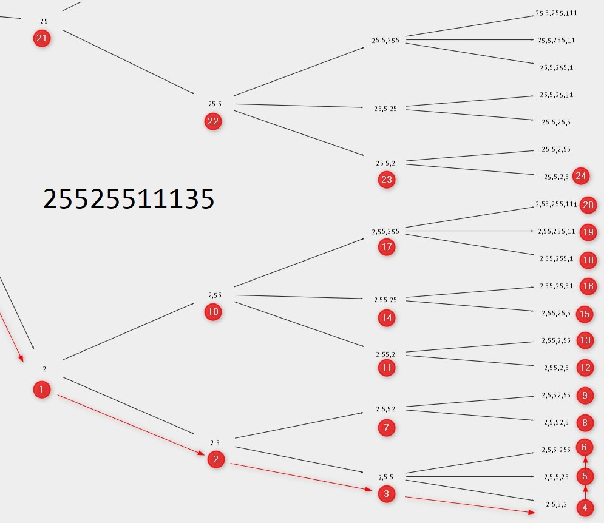
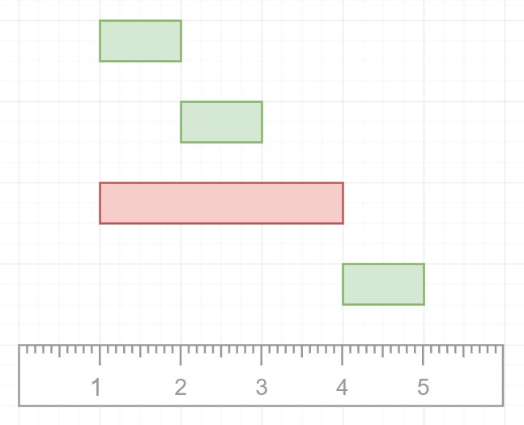

## Permutations

## Backtracking



```js
function restoreIpAddresses(originalString) {
  // originalString = 25525511135
  const result = [];
  backtrack(0, []);
  return result;

  function backtrack(start, tempArr) {
    // push results - called 2 times
    if (tempArr.length === 4 && start === originalString.length) {
      result.push(tempArr.join("."));
      return;
    }

    // 4th level reached, don't go deeper
    if (tempArr.length === 4) {
      return;
    }

    // try 1-char, 2-char, 3-char long combinations
    for (let i = 1; i < 4; i++) {
      const sub = originalString.substring(start, start + i);

      if (sub.length > 1 && sub[0] === "0") {
        continue;
      }

      if (parseInt(sub) < 256 && parseInt(sub) >= 0) {
        // add sibling
        tempArr.push(sub);
        // validate sibling
        backtrack(start + i, tempArr);
        // remove sibling
        tempArr.pop();
      }
    }
  }
}

restoreIpAddresses("25525511135");
```

## Greedy

Make best choice at the moment.

- Break into subproblems
- Find optimal substructure (idea)
- Sort (time/distance/size)
- Solve greedily (iteration/recursion)

!> Does not always find optimal solution!

<details>
<summary>Example</summary>

- Break into subproblems ➡️ selection of events (select / remove)
- Find optimal substructure (idea) ➡️ every interval must finish as soon as possible to include more events
- Sort (time/distance/size) ➡️ sort by end time
- Solve greedily (iteration/recursion) ➡️ iterate



```js
function countOverlapIntervals(intervals) {
  if (intervals.length == 0) return 0;

  intervals.sort((a, b) => a[1] - b[1]);

  let overlapIntervals = 0;
  let lastEventEnd = intervals[0][1];

  for (let i = 1; i < intervals.length; i++) {
    const [currentEventStart, currentEventEnd] = intervals[i];

    if (currentEventStart < lastEventEnd) {
      // overlap, choose the one that finish first (remove biggest blocker)
      lastEventEnd = Math.min(currentEventEnd, lastEventEnd);
      overlapIntervals++;
    } else {
      // no overlap, update current event end
      lastEventEnd = currentEventEnd;
    }
  }

  return overlapIntervals;
}

countOverlapIntervals([
  [1, 2],
  [2, 3],
  [1, 4],
  [4, 5],
]);
```

</details>

## Divide and conquer

Optimizes by breaking down into simpler versions of itself.

## Dynamic programming

Optimizes by caching solutions.
