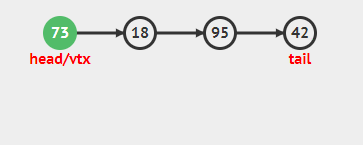
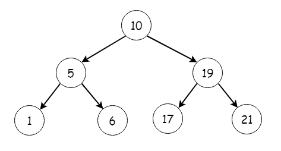
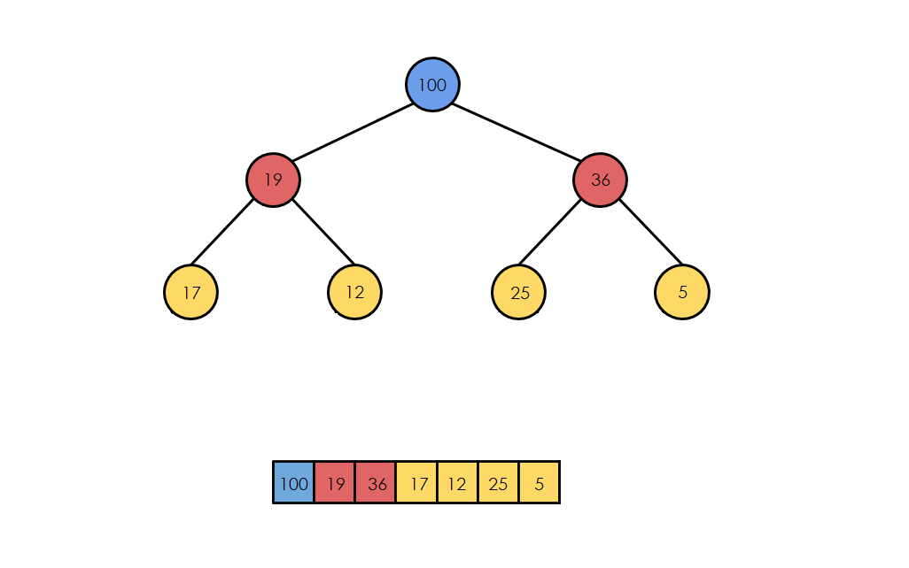

## Singly linked list


```js
const singlyLinkedList = {
  head: {
    value: 12,
    next: {
      value: 99,
      next: {
        value: 37,
        next: null,
      },
    },
  },
  tail: {
    value: 37,
    next: null,
  },
  length: 3,
};
```

<details>
<summary>Implementation</summary>

```js
class Node {
  constructor(value) {
    this.value = value;
    this.next = null;
  }
}
```

```js
class SinglyLinkedList {
  constructor() {
    this.head = null;
    this.tail = null;
    this.length = 0;
  }
   /*
   * get, set
   * push, pop
   * shift, unshift
   * /
}
```

</details>

<details>
<summary>Usage</summary>

- build Stack and Queue
- undo functionality in programs

</details>

## Doubly linked list


```js
const doublyLinkedList = {
  head: {
    value: 12,
    next: {
      value: 99,
      next: {
        value: 37,
        next: null,
        prev: "[Circular]",
      },
      prev: "[Circular]",
    },
    prev: null,
  },
  tail: {
    value: 37,
    next: null,
    prev: {
      value: 99,
      next: "[Circular]",
      prev: {
        value: 12,
        next: "[Circular]",
        prev: null,
      },
    },
  },
  length: 3,
};
```

<details>
<summary>Implementation</summary>

```js
class Node {
  constructor(val) {
    this.val = val;
    this.next = null;
    this.prev = null;
  }
}
```

```js
class DoublyLinkedList {
  constructor() {
    this.head = null;
    this.tail = null;
    this.length = 0;
  }
  /*
   * get, set
   * push, pop
   * shift, unshift
   * /
}
```

</details>

<details>
<summary>Usage</summary>

- browser history
- undo and redo functionality in programs

</details>

## Stack


```js
const stack = {
  head: {
    value: 12,
    next: {
      value: 99,
      next: {
        value: 37,
        next: null,
      },
    },
  },
  tail: {
    value: 37,
    next: null,
  },
  length: 3,
};

// or

const stack = [12, 99, 37];
```

<details>
<summary>Implementation</summary>

- via Array

- via Singly Linked List

```js
import SinglyLinkedList from "SinglyLinkedList";

class Stack {
  constructor() {
    this.queue = new SinglyLinkedList();
  }

  push(value) {
    this.queue.unshift(value);
  }

  pop() {
    this.queue.shift();
  }
}
```



</details>

<details>
<summary>Usage</summary>

- javascript call stack
- undo/redo in Photoshop
- routing in javascript frameworks

</details>

## Queue


```js
const stack = {
  head: {
    value: 12,
    next: {
      value: 99,
      next: {
        value: 37,
        next: null,
      },
    },
  },
  tail: {
    value: 37,
    next: null,
  },
  length: 3,
};

// or

const stack = [12, 99, 37];
```

<details>
<summary>Implementation</summary>

- via Array

- via Singly Linked List

```js
import SinglyLinkedList from "SinglyLinkedList";

class Stack {
  constructor() {
    this.stack = new SinglyLinkedList();
  }

  enqueue(value) {
    this.stack.push(value);
  }

  dequeue() {
    this.stack.shift();
  }
}
```


</details>

<details>
<summary>Usage</summary>

- printing

</details>

## Binary search tree



```js
const binarySearchTree = {
  root: {
    value: 10,
    left: {
      value: 6,
      left: {
        value: 3,
        left: null,
        right: null,
      },
      right: {
        value: 8,
        left: null,
        right: null,
      },
    },
    right: {
      value: 15,
      left: null,
      right: {
        value: 20,
        left: null,
        right: null,
      },
    },
  },
};
```

<details>
<summary>Implementation</summary>

```js
class Node {
  constructor(val) {
    this.val = val;
    this.left = null;
    this.right = null;
  }
}
```

```js
class BinarySearchTree {
  constructor() {
    this.root = null;
  }
  /*
   * insert, find, contains
   * bfs, dfs
   * preOrder, postOrder, inOrder
   * /
}
```


</details>

<details>
<summary>Usage</summary>

- database indexing and search
- Huffman coding algorithm (file compression)
- Array can be converted to BST
- much faster than `Array` at search, insert, and delete (does not store indices unlike `Array`)
  - Array O(n)
  - BST O(log n)
- mcuh slower than `Array` at access
  - Array O(1)
  - BST O(log n)

</details>

## Hash table


```js
const hashTable = {
  keyMap: [
    null,
    [['Sue', 'F'], ['Nell', 'F']],
    null,
    [['Joe', 'M'], ['Ally', 'F'], ['Bob', 'M']],
    [['Dan', 'M']]
  ];
}
```

<details>
<summary>Implementation</summary>


```js
class HashTable {
  constructor(size = 5) {
    this.keyMap = new Array(size);
    // this = { keyMap: [ , , , , ] }
  }

  _hash(key) {
    // return 3
  }

  set(key, value) {
    // [ , , [ 'Joe', 'M' ] , , ]
  }

  get(key) {
    // "M"
  }
}

let ht = new HashTable(5);

ht.set("Joe", "M");
// add more...
```

</details>

<details>
<summary>Usage</summary>

- efficiently lookup without relying on a linear search
- much faster than `Array` at search, insert, and delete
  - Array O(n)
  - Hash Table O(1)
- search in Ski Rent by shoes size
- search citizen passport deatils by ID
  - Array
    - check every ID starting from `1` untill, let's say, `9999`
  - Hash Table
    - convert `Vladimir Putin` to `1002` and directly access it

</details>

## Heap



```js
const heap = {
  arr: [100, 19, 36, 17, 12, 25, 5],
};
```

<details>
<summary>Implementation</summary>

```js
class MaxBinaryHeap {
  constructor() {
    this.arr = [];
  }

  // bubbleUp, sinkDown

  insert(elem) {
    // 1. push to the end
    // 2. compare with parent and if bigger - swap
    // 3. repeat until correct position
  }

  extractMax() {
    // 1. remove head (max) and put tail (smallest) as new head
    // 2. compare head with children and with smallest - swap
    // 3. repeat until correct position
  }
}

let heap = new MaxBinaryHeap();

heap.insert(41);
// insert more
```

</details>

<details>
<summary>Usage</summary>

- much faster than `Array` at getting the minimum or the maximum value
  - Linked List O(n)
  - Array O(n)
  - Heap O(1)
- OS use heaps for scheduling jobs on a priority basis
- to build Priority Queue
  - if you have a FastPass ticket you can bypass the entire line
  - handicapped individuals are taken to the front of the line
- does not support the searching operations

</details>

## Priority queue


```js
const priorityQueue = {
  arr: [
    {
      value: "Breath",
      priority: 100,
    },
    {
      value: "Eat",
      priority: 19,
    },
    {
      value: "Drink",
      priority: 36,
    },
    {
      value: "Sleep",
      priority: 17,
    },
    {
      value: "Read",
      priority: 12,
    },
    {
      value: "Speak",
      priority: 25,
    },
    {
      value: "Pray",
      priority: 5,
    },
  ],
};
```

<details>
<summary>Implementation</summary>

</details>

<details>
<summary>Usage</summary>

- 

</details>

## Graph

| Adjacency List                     | Adjacency Matrix                   |
| ---------------------------------- | ---------------------------------- |
| Less space                         | More space                         |
| Fast to iterate over all edges     | Slow to iterate over all edges     |
| Slow to lookup for a specific edge | Fast to lookup for a specific edge |
