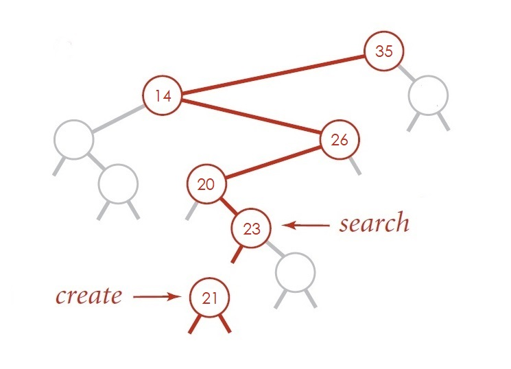
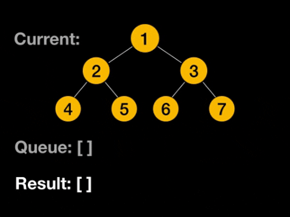

## Singly linked list


<details>
<summary>Implementation</summary>

```js
class Node {
  constructor(val) {
    this.val = val;
    this.next = null;
  }
}
```

```js
class SinglyLinkedList {
  constructor() {
    this.head = null;
    this.tail = null;
    this.length = 0;
  }
   /*
   * get, set
   * push, pop
   * shift, unshift
   * /
}
```

</details>

#### Usage

- build Stack and Queue
- undo functionality in programs

## Doubly linked list


<details>
<summary>Implementation</summary>

```js
class Node {
  constructor(val) {
    this.val = val;
    this.next = null;
    this.prev = null;
  }
}
```

```js
class DoublyLinkedList {
  constructor() {
    this.head = null;
    this.tail = null;
    this.length = 0;
  }
  /*
   * get, set
   * push, pop
   * shift, unshift
   * /
}
```

</details>

#### Usage

- browser history
- undo and redo functionality in programs

## Stack


<details>
<summary>Implementation</summary>

- via Array
- via Singly Linked List

  - `push()` via `unshift()`
  - `pop()` via `shift()`


</details>

#### Usage

- javascript call stack
- undo/redo in Photoshop
- routing in javascript frameworks

## Queue


<details>
<summary>Implementation</summary>

- via Array
- via Singly Linked List
  - `enqueue()` via `push()`
  - `dequeue()` via `shift()`


</details>

#### Usage

- printing

## Binary search tree



<details>
<summary>Implementation</summary>

```js
class Node {
  constructor(val) {
    this.val = val;
    this.left = null;
    this.right = null;
  }
}
```

```js
class BinarySearchTree {
  constructor() {
    this.root = null;
  }
  /*
   * insert, find, contains
   * bfs, dfs
   * preOrder, postOrder, inOrder
   * /
}
```

Example

```js
{
  "root": {
    "value": 10,
    "left": {
      "value": 6,
      "left": {
        "value": 3,
        "left": null,
        "right": null
      },
      "right": {
        "value": 8,
        "left": null,
        "right": null
      }
    },
    "right": {
      "value": 15,
      "left": null,
      "right": {
        "value": 20,
        "left": null,
        "right": null
      }
    }
  }
}
```

</details>

#### Usage

- database indexing and search
- Huffman coding algorithm (file compression)
- Array can be converted to BST
- much faster than `Array` at search, insert, and delete (does not store indices unlike `Array`)
  - Array O(n)
  - BST O(log n)
- mcuh slower than `Array` at access
  - Array O(1)
  - BST O(log n)

```js
var tree = new BinarySearchTree();

[14, 25, 54, 12, 66].forEach((value) => tree.insert(value));
```

## BFS



<details>
<summary>Implementation</summary>

- based on Queue
- can be applied to any Binary Tree
  - because of `node.left` and `node.right`

```js
bfs() {

  let node = this.root;
  const result = [];
  const queue = [node];

  while (queue.length) {
    node = queue.shift();
    result.push(node.val);
    if (node.left) queue.push(node.left);
    if (node.right) queue.push(node.right);
  }

  return result;

}

var tree = new BinarySearchTree();

tree.insert(10);
// insert more...

tree.bfs();
```

</details>

#### Usage

- best for deep tree

## DFS


<details>
<summary>Implementation</summary>

- based on recursion

```js
dfs() {

  const result = [];

  function traverse(node) {
    // result.push(node.val); -> pre-order
    if (node.left) traverse(node.left);
    // result.push(node.val); -> in-order
    if (node.right) traverse(node.right);
    // result.push(node.val); -> post-order
  };

  traverse(this.root);

  return result;

}

var tree = new BinarySearchTree();

tree.insert(10);
// insert more...

tree.dfs();
```

</details>

#### Usage

- best for wide tree

## Graph

| Adjacency List                     | Adjacency Matrix                   |
| ---------------------------------- | ---------------------------------- |
| Less space                         | More space                         |
| Fast to iterate over all edges     | Slow to iterate over all edges     |
| Slow to lookup for a specific edge | Fast to lookup for a specific edge |
