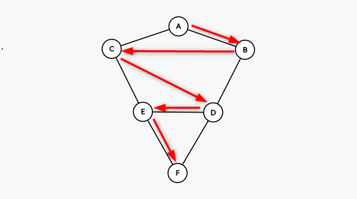
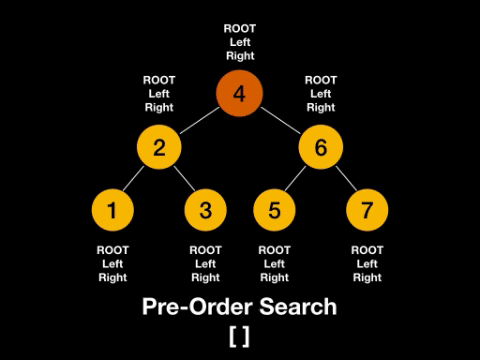

## BFS

💡 we add nodes that we have discovered — but not yet visited — to our queue, and come back to them later

- based on Queue
- can be applied to any Binary Tree
  - because of `node.left` and `node.right`
- best for deep tree 


#### Binary search tree

```js
function bfs(tree) {
  let node = tree.root;
  const result = [];
  const queue = [node];
  // queue = [1]
  // result = []

  while (queue.length) {
    node = queue.shift();
    // queue = []
    // result = [] - not yet fully visited
    if (node.left) queue.push(node.left);
    // queue = [2] - add new target to visit
    // result = [] - not yet fully visited
    if (node.right) queue.push(node.right);
    // queue = [2, 3] - add new target to visit
    // result = [] - not yet fully visited
    result.push(node.value);
    // queue = [2, 3]
    // result = [1] - visited!
  }

  return result;
}
```

#### Graph



```js
function bfs(start) {
  const result = [];
  const visited = {};
  const queue = [start];
  // queue = ["A"]
  let currVertex;

  visited[start] = true;
  // visited = { "A": true }

  while (queue.length) {
    currVertex = queue.shift();
    // queue = []
    // currVertex = "A"
    result.push(currVertex);
    // result = ["A"]

    this.adjList[currVertex].forEach((neighbor) => {
      // neighbor = "B"
      // neighbor = "C"
      if (!visited[neighbor]) {
        visited[neighbor] = true;
        // visited = { "A": true, "B": true, "C": true }
        queue.push(neighbor);
        // queue = ["B", "C"]
      }
    });
  }

  return result;
}
```

## DFS

💡 we add all left nodes recursively downwards and add new recursive calls to callstack, when bottom reached, javascript will pop last item from the callstack

- based on stack (last in — first out)
- best for wide tree



#### Binary search tree

```js
function dfs(tree) {
  const result = [];

  function traverse(node) {
    // stack = [traverse(4)]
    result.push(node.value);
    // result = [4]
    // result = [4, 2]
    // result = [4, 2, 1]
    if (node.left) traverse(node.left);
    // stack = [traverse(4), traverse(2)]
    // stack = [traverse(4), traverse(2), traverse(1)]
    if (node.right) traverse(node.right);
    // stack = [traverse(4), traverse(2)]
  }

  traverse(tree.root);

  return result;
}
```

#### Graph


```js
function dfs(start) {
  const result = [];

  const visited = {};
  const adjList = this.adjList;
  /*
   *     adjList: {
   *       A: ["B", "C"],
   *       B: ["A", "D"],
   *       C: ["A", "E"],
   *       D: ["B", "E", "F"],
   *       E: ["C", "D", "F"],
   *       F: ["D", "E"],
   *     }
   */

  function traverse(vertex) {
    // vertex = "A"
    // vertex = "B"
    // vertex = "D"
    // vertex = "E"
    // vertex = "C"
    if (!vertex) return null;

    visited[vertex] = true;
    // visited = { "A": true }
    // visited = { "A": true, "B": true }
    // visited = { "A": true, "B": true, "D": true }
    // visited = { "A": true, "B": true, "D": true, "E": true }
    // visited = { "A": true, "B": true, "D": true, "E": true, "C": true }
    // visited = { "A": true, "B": true, "D": true, "E": true, "C": true, "F": true }

    result.push(vertex);
    // result = ["A"]
    // result = ["A", "B"]
    // result = ["A", "B", "D"]
    // result = ["A", "B", "D", "E"]
    // result = ["A", "B", "D", "E", "C"]
    // result = ["A", "B", "D", "E", "C", "F"]

    adjList[vertex].forEach((neighbor) => {
      if (!visited[neighbor]) {
        return traverse(neighbor);
        // traverse("B")
        // traverse("D")
        // traverse("E")
        // traverse("C")
      }
    });
  }

  traverse(start);
  // traverse("A")

  return result;
}
```
