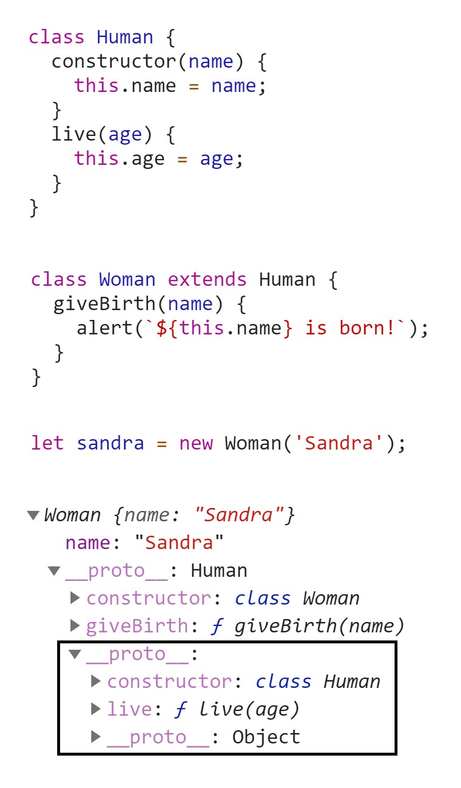

#### Prototypal inheritance

- programming paradigm when objects directly inherit from another objects (unlike OOP where classes inherit from classes)

- everything instantiated via `new` keyword gets `__proto__` pointing to `prototype` that contains parent methods

- top of the protypal chain is base `object` (not an `Object`)

- advantages

  - memory efficience (reuse methods instead of copying it)

- create object from prototype (2 ways)

  - `Object.create( <Object> .prototype)`

```js
const elfFunctions = attack() {
  return 'attack'
}

const newElf = Object.create(elfFunctions)

newElf.name = 'Alex'
newElf.weapon = 'Hammer'
```

  - `new <Object>` ("constructor function")

```js
function Elf(name, weapon) {
  this.name = name;
  this.weapon = weapon;
}

Elf.prototype.attack = () => {
  return 'attack'
}

const alex = new Elf('Alex', 'Hammer')
```

#### Keyword `new`

- suppose we have a constructor function

  - `function Animal(name) { this.name = name; }`

- `var cat = new Animal('Dora')` creates instance:

  - creates blank plain `object`

    - `var obj = {};`

  - sets `__proto__` to `prototype` of given object

    - `obj.__proto__ = Animal.prototype`

  - if arguments are provided they are assigned to `this`

    - `this.name = "Dora"`

  - returns `obj`   
 
 #### Inheritance
 
- implemented via `Class` and `extend`

- stateful

  - functions live together with state in one class

- Problems

  - taxonomy should be perfectly designed in the beginning, otherwise hard to make changes to hierarchy

  - can lead to "gorilla-banana problem"

  - tight coupling

 #### Class

- syntactic sugar on top of prototypal inheritance

- `constructor`

  - we are not including instance methods into constructor not to overload memory (when calling with `new Animal()` )

- `extends`

  - adds parent's class `__proto__` to current class `__proto__`

#### How extends work

